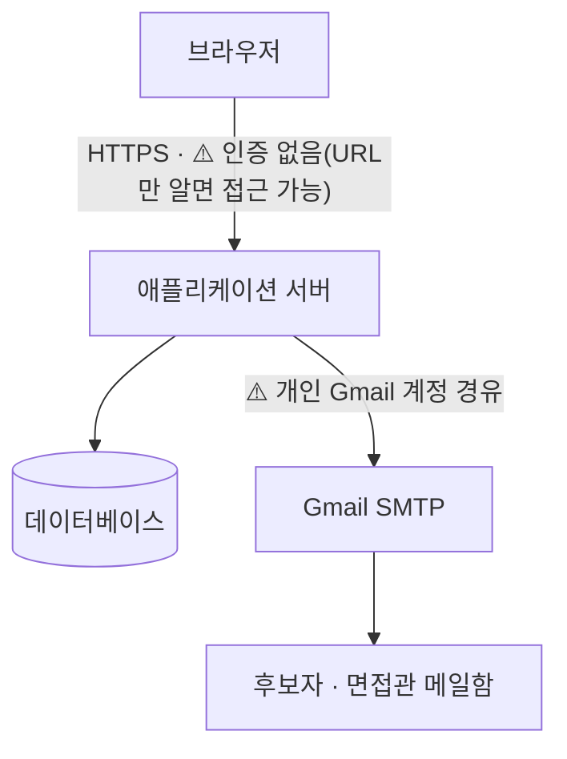
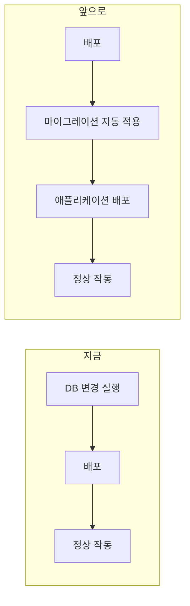

## 제출 정보

- **작동 링크**: https://interview-sync-nu.vercel.app/interviews
- **소스 코드**: https://github.com/risa02076-code/interview-sync
- **개선 사항 한 줄**: 클라이언트가 Supabase를 직접 호출하던 이전 방식 대신 Next.js API 라우트를 백엔드 계층으로 분리했고, 이후 Gmail 발송 → 응답 링크 제출 → 자동 매칭까지 사람 개입 없이 이어지는 이메일 기반 조율 파이프라인으로 확장함

---

# 인터뷰싱크 (Interview Sync)

면접 일정 자동 매칭 서비스 — 후보자 등록 한 번이면, 면접 패널 전원에게 가능 시간을 문의하고, 전원 응답하면 후보자에게 희망 시간을 문의하고, 후보자가 응답하면 자동으로 매칭까지 끝낸다.

PRD는 [PRD.md](./PRD.md) 참고.

## 기능

- **후보자 등록 → 자동 파이프라인 시작**: 이름·이메일·직무·면접 패널만 입력하면, 등록 즉시 패널 전원에게 "불가능한 시간"을 묻는 이메일이 자동 발송된다 (Gmail SMTP).
- **면접관 응답 → 충돌 최소 시간 추천 → 후보자 자동 안내**: 패널 전원이 응답 링크로 제출을 마치면, 그 가용 시간 데이터를 바탕으로 전원 동시 가능한 시간을 계산해 곧바로 후보자에게 자동 안내한다. 완전히 겹치지 않는 시간은 개수 제한 없이 전부 날짜별로 묶어 보여주고(하나도 없으면 충돌이 가장 적은 시간들을 최대 3개까지 대안으로), 응답 페이지를 열어둔 동안 주기적으로 다시 계산해 그 사이 면접관 일정이 바뀌면 화면에 반영한다 — 이미 선택했던 시간이 사라지면 조용히 지우지 않고 경고로 알려준다.
- **후보자 우선순위 제출 → 면접관 전원 최종 확인 → 자동 확정**: 후보자는 편한 순서대로 최대 3개까지 우선순위를 골라 제출한다(단일 확정이 아니라 순위제라, 1순위가 그 사이 안 되게 되어도 2·3순위로 버틸 여지가 있다). 제출 즉시 면접관 전원에게 그 1~3개 시간 각각 참석 가능한지 확인 요청이 자동으로 나가고, 전원이 응답을 마치면 전원 가능하다고 답한 가장 높은 순위로 자동 확정되어 확정 안내 메일(문제 있으면 알려달라는 안내 포함)이 나간다. 전원 가능한 순위가 없으면 리크루터에게 에스컬레이션된다. 리크루터는 이 과정을 기다리지 않고 케이스 상세에서 순위 중 하나를 직접 클릭해 먼저 확정할 수도 있다(그 자리에서 다시 실제로 비어있는지 검증).
- **완전 일치 시간이 없으면 후보자 안내 대신 재문의**: 면접관 전원이 응답해도 동시에 가능한 시간이 하나도 없으면 후보자에게 충돌 있는 시간을 안내하지 않고, 조회 기간을 5영업일씩 넓혀(최대 3차/영업일 15일) 면접관 전원에게 자동으로 재문의한다. 후보자·면접관 모두 "이 시간(기간)엔 다 안 돼요" 버튼으로 직접 재문의를 트리거할 수도 있다.
- **동적 슬롯 생성 (30분 단위)**: 하드코딩된 날짜 대신, 요청 시점 기준 "다음 영업일 5일 × 업무시간(09~18시) 30분 단위"를 매번 새로 계산한다 (`lib/slots.ts`) — when2meet과 같은 그리드 방식.
- **면접 소요시간을 1급 개념으로**: 면접을 격자 위의 "한 점"이 아니라 **구간**으로 다룬다. 대면 60분·온라인/전화 30분을 `lib/slots.ts` 한 곳에 두고, 점유·탐색·업무시간 초과·겹침 판정이 모두 그 값을 기준으로 계산된다. 이게 없을 때는 10:00에 확정된 1시간 면접의 10:30이 비어 보여 같은 면접관에게 면접이 또 잡혔다.
- **표시 시간을 한국 시간으로 고정**: `Date`의 로컬 getter는 코드가 도는 곳의 시간대를 따른다 — 서버(UTC)뿐 아니라 **해외에 있는 후보자의 브라우저**에서도 어긋난다. 슬롯 계산·라벨·캘린더를 전부 KST 고정으로 바꾸고, 메일에도 기준 시간대를 명시한다. 네 개 시간대(Asia/Seoul·UTC·America/New_York·Pacific/Auckland)에서 테스트가 모두 통과해야 정상으로 본다.
- **자동 재조율**: 확정된 면접의 면접관 일정 변경을 시뮬레이션하면, 전체 시간대를 다시 탐색해 자동으로 재조율한다.
- **확정 후 후보자 일정 변경 요청 → 자동 재조율**: 확정 메일에 들어있는 "일정 변경" 링크를 누르면 기존 시간을 취소하고, 이미 수합해둔 면접관 데이터로 다른 공통 시간이 있으면(시나리오 A) 곧바로 후보자에게 다시 제안하고, 없으면(시나리오 B) 면접관 전원에게 가능 시간을 처음부터 다시 수합한다 — 리크루터가 개입할 필요가 없다.
- **응답 현황 히트맵 + 수동 확정**: 자동 매칭이 안 되거나 직접 정하고 싶을 때, 면접 상세 화면에서 30분 격자 히트맵을 보고 시간을 골라 확정할 수 있다. **색은 "불가능하다고 답한 인원 수", 사선 무늬는 "아직 답하지 않은 사람이 있음"으로 채널을 분리했다** — 하나로 합치면 *가능하다고 답한 것*과 *아직 답하지 않은 것*이 같은 색이 되어, 담당자가 침묵을 승낙으로 오인한다. 칸을 누르면 "가능(답변 확인) / 불가능(답변 확인) / 미응답(추정)" 명단이 갈려 나오고, 조건은 통과하지만 근거가 답변이 아니라 침묵인 경우에는 그 사실을 문장으로 알린다.
- **조율 대시보드**: 후보자·직무·면접 패널·진행 단계·매칭 결과·확정 일정을 표로 한눈에 확인하고, CSV로 내보낼 수 있다.
- **면접관 관리**: 면접관별 이메일 등록, 현재 불가능 시간 확인, 개별 문의 메일 발송, 30분 단위 캘린더로 불가능 시간을 이메일 없이 직접 수정.
- **면접실 관리 + 정원**: 면접실 추가·이름 수정·사용 여부를 화면에서 관리한다. **정원을 넣으면 매칭이 "면접관 수 + 후보자 1명"이 들어가는 방만 고른다** — 이게 없을 때는 면접관 4명 면접에 2인실이 배정돼도 시스템이 알 방법이 없었다. 정원을 비워두면 "아직 모름"으로 보고 종전대로 제한하지 않되, 화면이 "정원 미입력 N개"로 그 사실을 알린다(모르는 것과 작은 것은 다르고, 모른다고 막으면 값을 넣기 전까지 확정이 전부 멈춘다). 이미 면접에 쓰인 방은 지우지 않고 **"사용 안 함"**으로 두어 지난 기록에서 면접실 이름이 사라지지 않게 한다. 면접실별 **사용 현황 격자**에서 언제 차 있고 언제 비어 있는지, 그리고 그 시간이 *어느 면접 때문인지*까지 볼 수 있다.
- **자동 리마인더**: 매일 도는 크론(`/api/cron/reminders`)이 두 가지를 처리한다. ① 요청 후 2일이 지나도록 응답이 없는 면접관·후보자에게 독촉 메일을 최대 3회까지 2일 간격으로 재발송한다(링크는 최초 토큰을 재사용). ② 내일 면접인 확정 케이스의 후보자·면접관 전원에게 전날 알림을 1회 발송한다. 리크루터가 대시보드를 지켜보다 수동으로 누를 필요가 없다.

## 신뢰성 — 자동으로 메일이 나가는 서비스라서

후보자와 면접관에게 사람 확인 없이 메일이 나가고 일정이 확정되므로, **가장 큰 위험은
"자동화가 실패했다는 사실 자체가 드러나지 않는 것"**이다. 메일 한 통이 안 나가도, 크론이
조용히 안 돌아도, 화면에는 아무 표시가 없고 채용 프로세스만 멈춘다. 그래서 완성도를
"몇 단계를 줄였는가"가 아니라 **"실패를 얼마나 빨리 알아채고 되돌릴 수 있는가"**로 정의했다.

**나가기 전에 막는 것**

- **확정을 하나의 트랜잭션으로 묶음** — 확정 한 건은 저장이 세 군데로 나뉜다(면접 행,
  면접관별 캘린더, 면접실 캘린더). supabase-js는 여러 요청을 한 트랜잭션으로 묶지
  못하므로(요청 하나가 곧 트랜잭션 하나) 중간에 하나가 실패하면 *"확정됐다고 적혀 있는데
  캘린더는 비어 있는"* 반쪽 상태가 남고, 두 건이 동시에 같은 시간을 확정하면 둘 다 통과한다.
  세 번의 쓰기를 DB 함수(`confirm_interview`)로 옮겨 rpc로 한 번만 부른다 — 전부 되거나
  전부 안 되고, 그 안에서 잠근 뒤 다시 확인해 이중 배정을 실제로 막는다.
  판단 로직(어느 시간이 가능한지, 몇 칸을 차지하는지)은 plpgsql로 옮기지 않고 TypeScript에
  남겼다. plpgsql은 tsc도 vitest도 닿지 않아서, 옮기면 검증이 통째로 사라진다.
- **확정 메일 발송 직전 재검증 + 사람 승인 게이트** — 가장 되돌릴 수 없는 메일이라,
  자동 확정까지 마쳐도 실제 발송은 담당자가 버튼을 눌러야 나간다. 누르는 순간 그 건 하나를
  다시 검사하고, 위반이면 발송을 **보류**하고 사유를 화면에 보여준다(사유를 확인한 뒤
  그대로 진행할 수도 있다 — 되돌릴 수 없는 발송이라 확인을 한 번 더 묻는다).
- **킬 스위치** — `EMAIL_SENDING_ENABLED=false`면 코드 배포 없이 전체 자동 발송을 즉시 멈춘다.

**나갔다면 알아채는 것**

- **발송 실패 가시화** — 메일을 보내는 *모든* 경로(초대·재문의·최종 확인·확정·리마인더)가
  실패 시 사유를 `interview.note`에 남겨 대시보드에 바로 뜬다. `email_sent_at`을 응답 여부와
  분리해 기록하므로 **"아직 답을 안 함"과 "메일이 애초에 안 갔음"이 구분된다.**
- **데이터 정합성 검사** — 매일 1회 크론(`/api/cron/consistency-check`)이 전체를 스캔한다.
  이중 배정은 슬롯 문자열 일치가 아니라 **시간 구간 겹침**으로 판정한다.
- **헬스체크** — `/api/health`가 단순히 페이지가 열리는지가 아니라 실제로 DB에 접근
  가능한지까지 확인해, 외부 모니터링이 장애를 감지할 수 있게 한다.

**검증**

- `npm run verify` — lint → 타입검사 → 테스트. 테스트 **207개 / 20파일**.
- 사람이 실행을 잊어도 돌도록 두 겹으로 막았다: `prebuild`가 빌드 직전에 돌려 실패하면
  `next build`까지 가지 못하고, GitHub Actions가 push·PR마다 돌린다.
- plpgsql처럼 vitest가 닿지 않는 영역은 실제 DB에 대고 확인하는 스크립트를 따로 뒀다
  (`scripts/verify-confirm-transaction.ts` — 원자성, 이중 배정 차단, 동시 호출 시 한 건만 성공).

무엇을 왜 지금 막았고 무엇을 왜 미뤘는지에 대한 판단 근거, 그리고 작업 이력과
**알려진 한계**는 [PROGRESS.md](./PROGRESS.md)에 있다.

## 진행 단계 (stage)

각 면접 케이스는 아래 단계를 순서대로 지나간다. 면접관 → 후보자 순서를 시스템이 강제하므로, 면접관 전원이 응답하기 전에는 후보자에게 메일이 나가지 않는다.

`created` → `interviewer_pending` → `interviewer_done` → `candidate_pending` → `candidate_done` → `priority_confirm_pending`(면접관 전원에게 참석 가능 여부 확인 중, 전원 응답 완료 시 자동 확정)

## 스택

- Next.js 16 (App Router) — 프론트엔드 + API 라우트(백엔드)
- Supabase (Postgres) — 서버 전용 서비스 롤 키로만 접근, 브라우저는 항상 `/api/*`를 거침
- Nodemailer + Gmail SMTP — 면접관/후보자 문의 메일 발송
- Vercel Cron — 매일 리마인더·정합성 검사 배치 실행 (`vercel.json`)
- Vitest — 단위 테스트 (매칭·슬롯 계산·상태 파생·응답 분류·정합성 검사 등 순수 로직)
- GitHub Actions — push·PR마다 lint → 타입검사 → 테스트 (`.github/workflows/ci.yml`)
- Tailwind CSS + shadcn/ui

## 로컬 실행

```bash
npm install
# .env.local 에 Supabase URL/키, GMAIL_USER, GMAIL_APP_PASSWORD 설정
npm run dev
```

DB는 `supabase/schema.sql`로 만들고, 그 뒤 `supabase/migration_*.sql`을 Supabase SQL
Editor에서 실행한다. **마이그레이션이 코드보다 먼저다** — 특히
`migration_confirm_transaction.sql`은 앱이 그 DB 함수를 호출하도록 바뀌어 있어서,
함수가 없는 DB에 새 코드를 올리면 확정이 전부 실패한다.

```bash
npm run verify                    # lint + 타입검사 + 테스트

# 시간 계산은 실행 환경의 시간대에 의존하지 않아야 한다. 전부 통과해야 정상.
TZ=UTC npx vitest run
TZ=America/New_York npx vitest run
TZ=Pacific/Auckland npx vitest run

# 실제 Supabase가 필요한 검증 (scripts/README.md 참고)
npm run verify:confirm-transaction   # 확정 트랜잭션이 실제로 원자적인지
npm run backfill:busy-slots          # 옛 확정 건의 점유 구간에 빠진 곳이 있는지(미리보기)
```

## 에러 해결 기록

- **미들웨어가 모든 페이지를 로그인으로 튕겨내던 문제**: 스타터 템플릿의 기본 미들웨어(`lib/supabase/proxy.ts`)는 미인증 사용자를 루트(`/`)를 제외한 모든 경로에서 `/auth/login`으로 리다이렉트하도록 되어 있었다. 이 앱은 로그인 기능이 없는 내부 도구라, `/interviews` 화면은 물론 `/api/interviews` 요청까지 전부 로그인 페이지로 튕겨나가 대시보드가 무한 로딩 상태에 빠졌다. 원인을 찾아 해당 리다이렉트 로직을 제거해 해결했다.
- **재조율 로직이 후보자의 원래 희망시간에 갇히는 문제**: 프로토타입 단계에서, 확정된 면접의 면접관 일정이 바뀌었을 때 후보자가 처음 제출한 희망시간 안에서만 대체 슬롯을 찾도록 짰더니 후보자 대부분이 희망시간을 1~2개만 제출하는 상황에서 재조율 성공률이 낮을 위험이 있었다. 재조율 시에는 원래 희망시간 제한을 풀고 전체 시간대를 재탐색하도록 `lib/matching.ts`의 로직을 수정했다.
- **`cacheComponents` 설정으로 배포 빌드가 실패하던 문제**: `/interviews/[id]` 등은 클라이언트에서 fetch로 데이터를 받아오는 화면인데, 스타터의 `next.config.ts`에 켜져 있던 `cacheComponents`(PPR 캐시 경계 강제 검사)가 "Uncached data accessed outside of Suspense" 에러를 내며 빌드를 막았다. 이 앱의 화면 구조와 맞지 않는 실험적 옵션이라 비활성화했다.
- **슬롯을 인덱스로 고정해뒀던 설계의 한계**: 초기에는 "7/20~7/24" 같은 날짜를 배열 인덱스(0~9)로 하드코딩해 모든 케이스가 항상 같은 목록을 봤다. 실사용에서는 말이 안 되는 설계라, 슬롯을 실제 ISO 날짜 문자열로 바꾸고 매 요청 시점 기준 "다음 영업일 5일"을 동적으로 계산하도록(`lib/slots.ts`) 데이터 구조 전체(면접관/면접실/면접 케이스의 슬롯 컬럼)를 다시 설계했다.
- **로컬에서는 멀쩡한데 배포 서버에서만 9시간 어긋나던 문제**: 업무시간(09~18시) 슬롯을 만들 때 `Date`의 `setHours`/`getHours`를 썼는데, 이건 코드가 도는 컴퓨터의 시간대를 그대로 따른다. 로컬은 한국 시간이라 전혀 문제가 안 보이고 **UTC로 도는 Vercel 서버에서만** "오전 9시"라고 표시되는 슬롯이 실제로는 오후 6시를 가리켰다. 프로덕션에 직접 `/api/slots`를 호출해 어긋남을 확인한 뒤 고정 오프셋 방식으로 고쳤다. 더 문제였던 건 **기존 테스트가 이 버그를 가려주고 있었다는 것** — 타임존 표시가 없는 날짜 문자열을 쓰고 있어서 실행 환경에 따라 다르게 해석됐다. 테스트도 타임존을 명시한 문자열로 다시 썼다.
- **테스트가 "0 test"로 조용히 건너뛰어지던 문제**: vitest에 `@/*` 경로 별칭 설정이 없어서, `app/` 아래 테스트가 임포트 단계에서 통째로 로드에 실패하고 있었다. **개별 실패가 아니라 파일 자체가 스킵되는 것**이라 통과 개수만 보면 검증된 것처럼 보인다. `Tests` 줄만 보지 말고 `Test Files` 줄이 전체 파일 수와 맞는지 함께 봐야 한다는 걸 여기서 배웠다.
- **격자의 시간 행이 뒤죽박죽 나오던 문제**: 면접실 사용 현황을 처음 열었을 때 `11:30, 09:00, 09:30...` 순으로 그려졌다. 격자 좌표를 만드는 함수가 시간 행을 **처음 등장한 순서**로 쌓고 있었고, 축의 첫 날에 슬롯이 하나뿐이면 그 시간이 맨 위로 올라갔다. 지금까지는 축이 항상 업무시간 전체를 덮어서 드러나지 않던 버그다(같은 코드를 응답 히트맵도 쓴다). 순수 함수로 빼내 값으로 정렬하고 테스트를 붙였다.
- **`npm run build` 뒤에 `next dev`를 띄우면 새 페이지가 404**: 프로덕션 `.next`를 dev 서버가 물어서 라우트를 못 찾는다. 화면은 정상인데 새로 만든 경로만 404가 나서 코드를 한참 들여다봤다. `rm -rf .next` 후 재시작하면 해결된다.
- **eslint가 `.next` 빌드 산출물까지 검사하던 문제**: `npm run lint` 실행 시 2만 건이 넘는 오류가 났는데, 확인해보니 전부 `.next/build`, `.next/dev` 등 자동 생성된 컴파일 결과물이었다. ESLint 9의 flat config는 `.eslintignore` 파일을 더 이상 인식하지 않는데 스타터의 `eslint.config.mjs`에 `ignores` 설정이 빠져 있어 생긴 문제로, 직접 추가해 해결했다.

## 회고

- 처음에는 Supabase 클라이언트를 프론트엔드에서 직접 호출하는 이전 프로젝트(Todo 앱) 방식을 그대로 가져가려 했으나, 과제 요구사항(백엔드 API 서버 구현)에 맞춰 Next.js API 라우트를 별도 계층으로 분리했다. 덕분에 매칭·재조율 같은 핵심 로직이 서버에만 존재하게 되어, 프론트엔드는 오직 `fetch`로만 통신하는 명확한 경계가 생겼다.
- 인증 미들웨어처럼 스타터 템플릿에 이미 들어있는 코드는 "당연히 되겠지"라고 넘기기 쉬운데, 실제로 로컬에서 눌러보지 않았다면 대시보드가 로그인 화면으로 튕기는 이유를 한참 못 찾았을 것이다. PRD·코드만으로 검증을 끝내지 않고 브라우저로 직접 눌러보는 과정의 중요성을 다시 확인했다.
- "면접관에게 물어보고 → 후보자에게 물어본다"는 순서는 말로는 당연해 보이지만, 실제로는 이메일 발송·응답 저장·다음 단계 자동 전환을 하나의 상태(`stage`)로 명시적으로 추적해야만 순서가 깨지지 않는다는 걸 구현하면서 체감했다. 상태를 암묵적으로("이 필드가 비어있으면 아직 안 보낸 것") 추론하려 했다면 훨씬 버그가 잦았을 것이다.
- **"데이터가 없는 것"과 "안 된다는 것"은 다르다.** 이 프로젝트에서 되풀이해 나온 구분이다. 면접관의 불가능 시간 목록이 비어 있는 것은 "전부 가능"일 수도 있고 "아직 답을 안 한 것"일 수도 있는데, 둘을 같게 취급하면 화면이 침묵을 승낙으로 보여준다. 면접실 정원이 없는 것도 "제한 없음"이 아니라 "아직 모름"이다. 두 경우 모두 **모른다는 사실 자체를 화면에 드러내는 쪽**(사선 무늬, "정원 미입력 N개")을 골랐다 — 모른다고 막아버리면 값을 채우기 전까지 서비스가 멈추고, 모른다고 통과시키면서 아무 말도 안 하면 사람이 잘못 믿는다.
- **막을 수 있는 것과 감시해야 하는 것은 다르다.** 처음에는 "확정 저장이 반쪽으로 끝나는 것"과 "동시에 같은 시간이 확정되는 것"을 막지 않고 사후 검사로 잡는 쪽을 골랐는데, 확정 흐름을 정리하면서 추가 비용 없이 차단까지 가능하다는 걸 알게 돼 트랜잭션으로 옮겼다. 다만 사후 검사는 그대로 뒀다 — 트랜잭션은 "정한 대로 저장되게" 할 뿐 **"정한 것이 옳은지"까지 보장하지는 않기 때문**이다. 정책상 일부러 허용한 위반(담당자가 충돌을 알고 직접 확정하는 경우)은 여전히 사후 검사만 잡는다.
- **자동 검증이 늘어도 사람이 확인해야 하는 영역은 줄지 않는다.** 자동 검사는 "데이터가 자기 자신과 앞뒤가 맞는지"만 볼 수 있다. 이 면접의 실제 소요시간이 맞는지, 그 시간이 실무적으로 괜찮은지, 면접관 조합이 직무에 적절한지는 규칙을 더 추가해도 줄지 않고 **그 정보를 데이터로 넣어야** 줄어든다. 실제로 면접실에 정원 컬럼을 넣자 "4명 면접에 2인실" 문제가 사람 확인 영역에서 자동 검증 영역으로 넘어왔다.

## 설계 자가점검 (통제·관측·이식성·비용·데이터 경로)

자동화 도구를 평가할 때 흔히 쓰는 5가지 기준 — 통제(Control)·관측(Observability)·이식성(Portability)·비용(Cost)·데이터 경로(Data Path) — 을 이 프로젝트에 그대로 적용해봤다. 인터뷰싱크는 LLM이 아니라 규칙 기반 자동화(정해진 순서를 코드가 그대로 실행)라, "사람이 하나씩 시키는 대화형"이나 "모델이 다음 행동을 고르는 에이전트형"이 아니라 **"그래프가 순서를 정하는 워크플로형"** 기준으로 판단했다.

| 기준 | 상태 |
| --- | --- |
| 데이터 경로 | ✅ |
| 통제 | ✅ |
| 관측 | ✅ (공백을 발견해 수정) |
| 비용 | 🟡 |
| 이식성 | ✅ |

### 목차

- [01. 데이터 흐름 점검](#01-데이터-흐름-점검) — 개인정보·비밀값의 이동 경로 확인
- [02. 자동화 통제 설계](#02-자동화-통제-설계) — 사람 승인·비상 중지 장치 적용
- [03. 실패 관측 구축](#03-실패-관측-구축) — 화면·로그·정합성 검사로 오류 추적
- [04. 비용 구조 검증](#04-비용-구조-검증) — 실측·추정 기반 운영비 산정
- [05. 이식성 확보](#05-이식성-확보) — 환경변수·DB 변경·배포 순서 표준화

### 01. 데이터 흐름 점검

**(데이터 경로)** 개인정보와 비밀값이 어디를 거쳐 이동하며, 외부에 노출될 가능성은 없는가?

**판단 기준**
브라우저·서버·외부 서비스를 구분해 데이터 흐름을 확인하고, 회사 관리 영역 밖으로 데이터가 나가는 지점과 현재 보안 한계를 명시한다.

**현재 설계**
- 런타임에서 LLM API를 호출하지 않아 후보자 데이터가 외부 LLM으로 전송되는 경로 없음
- 데이터베이스 접속 정보는 서버에만 존재하며, 브라우저는 데이터베이스에 직접 접근하지 않음
- 이메일 발송은 현재 개인 Gmail 계정을 경유 — 회사 데이터가 개인 계정을 거치는 위험 존재
- 인증·권한 기능이 없어 URL을 알고 있는 사용자가 후보자 정보에 접근할 수 있는 구조



**이렇게 나눈 이유**
현재는 테스트 데이터만 사용해 실제 개인정보 유출 위험을 제한하고 있지만, 현재 구조를 그대로 실데이터에 적용해서는 안 된다. 그래서 단순히 "보안상 문제없음"이라고 판단하지 않고, 데이터가 어디로 이동하는지와 회사 관리 영역 밖으로 나가는 지점을 명시해 실사용 가능 여부를 판단할 수 있게 했다.

**실사용 전 개선**

| 우선순위 | 개선 | 목적 |
| --- | --- | --- |
| 🔴 1 | 인증·권한 관리 | 비인가 사용자의 후보자 정보 접근 차단 |
| 🔴 2 | 회사 관리형 메일 인프라로 전환(예: 전용 이메일 발송 서비스, 회사 계정 등) | 개인 Gmail 경유 제거 |
| 🟡 3 | 접근·발송 감사 로그 강화 | 누가 어떤 데이터에 접근·발송했는지 추적 |

### 02. 자동화 통제 설계

**(통제)** 잘못됐을 때 사람이 개입하고 멈출 수 있는가?

**판단 기준**
계산과, 되돌릴 수 있거나 실수해도 피해가 적은 실행(리마인더·독촉 — 실패해도 다음 주기에 자동 재시도됨)은 자동화하되, 되돌릴 수 없는 실행(확정 메일)만 사람의 승인을 거친다.

**현재 설계**
- 일정 수합·매칭 → 자동
- 최적 시간 추천 → 자동
- 리마인더·독촉 메일 발송 → 자동(승인 없음, 실패해도 다음 주기에 자동 재시도)
- 최종 확정 메일 발송 → 리크루터 승인 필요(자동 확정 경로도 예외 없이 통일)
- 전체 발송 차단 → `EMAIL_SENDING_ENABLED` 환경변수 하나로 코드 재배포 없이 즉시 ON/OFF

**이렇게 나눈 이유**
일정 계산이나 리마인더는 실수해도 다시 계산하거나 다음 주기에 재시도되지만, 발송된 확정 메일은 회수가 어렵다. 되돌리기 어려운 행동일수록 사람의 통제를 남기는 방식으로 자동화 범위를 정했다.

**향후 자동화 확대**
전원이 겹침 없이 가능하고 면접실도 확보된 완벽한 매치인 경우에만(이미 이 조건만 걸러내는 `isImmediatelyBookable` 함수가 있다) 자동 발송 범위를 넓힐 수 있다. 다만 그 전에 감사 로그·실패 알림 같은 사후 추적 장치를 먼저 갖추는 게 전제다.

### 03. 실패 관측 구축

**(관측)** 잘못됐을 때 무엇이, 어디서, 왜 실패했는지 되짚을 수 있는가?

**판단 기준**
운영에 영향을 주는 실패는 리크루터가 확인할 수 있어야 하고, 원인 추적에 필요한 기술 정보는 개발자가 볼 수 있어야 한다.

**현재 설계**

| 상황 | 리크루터 | 개발자 |
| --- | --- | --- |
| 이메일 발송 실패 | 화면의 메모란에 사유 기록 | 로그 태그(서버 기록에서 검색어로 찾는 표시) `email-failed` |
| 확정 저장 실패 | 화면의 메모란에 사유 기록 | 로그 태그 `confirm-failed` |
| 데이터 정합성 위반 7종 | 화면의 메모란에 사유 기록 | 관리자 이메일로 위반 목록 요약 발송 |

**설계 이유**
같은 실패라도 필요한 정보가 다르다. 리크루터에게는 "무엇이 문제이고 다음에 무엇을 해야 하는지", 개발자에게는 "어디서 왜 실패했는지"가 필요하기 때문에 두 계층으로 나눠 기록했다.

**현재 한계**
- 정합성 검사는 크론(정해진 시각에 자동으로 실행되는 예약 작업)이 실행되어야 동작한다. 크론 자체가 중단된 경우에는 현재 구조로 감지할 수 없다.
- 앱·데이터베이스 전체 장애를 감지하는 헬스체크(외부에서 "살아있는지" 확인하는 전용 주소)는 만들어져 있지만, 이걸 주기적으로 두드려 알려주는 외부 모니터링 서비스 등록이 아직 안 돼 있어서 지금은 리크루터·개발자 누구도 실제 알림을 받지 못한다.

**다음 단계**
크론이 실행될 때마다 "언제 마지막으로 돌았는지"를 기록해두고, 외부 모니터링에서 그 시각을 감시해 일정 시간 기록이 없으면 알림하도록 보강한다. 헬스체크는 외부 모니터링 서비스 등록만 남아 있다.

### 04. 비용 구조 검증

**(비용)** 어떤 단위로 과금되며, 실제 비용을 확인할 수 있는가?

**판단 기준**
실제로 확인한 값과 가정에 기반한 추정값을 구분하고, 추정에는 산정 근거와 기준일을 함께 기록한다.

**현재 설계**
- 현재 데모의 직접 지출: 0원(개인 무료 티어 사용) — 무료 티어를 쓰고 있어 지출이 0원인 것이지, 운영 비용 자체가 0원이라는 뜻은 아니다
- 고정비(월 정액: 호스팅·데이터베이스·도메인), 변동비(사용량 비례: 이메일 발송량), 초기 구축 공수(현금으로 환산하지 않고 일수로 별도 표기)로 구분해 산정
- 서비스별 요금은 조사일(2026-08-24) 기준 공식 요금표에서 확인 — [Vercel Hobby 플랜](https://vercel.com/docs/plans/hobby), [Vercel 크론 요금](https://vercel.com/docs/cron-jobs/usage-and-pricing), [Supabase 일시정지 정책](https://supabase.com/docs/guides/platform/free-project-pausing), [Supabase 백업 정책](https://supabase.com/docs/guides/platform/backups), [AWS SES 요금](https://aws.amazon.com/ses/pricing/), [도메인 가격](https://www.cloudflare.com/learning/dns/how-much-does-a-domain-name-cost/)
- 모든 숫자에 실측/추정 라벨 부여

**서비스별 요금 구성** (월, 운영 담당자 1명 기준)

| 서비스 | 요금제 | 월 비용 | Pro로 가야 하는 이유 |
| --- | --- | --- | --- |
| Vercel(앱 호스팅) | Pro | 28,000원 | Hobby는 비상업용 개인 사용 전용이라, 회사 업무에 쓰는 순간 무조건 Pro여야 한다(선택이 아니라 필수) |
| Supabase(데이터베이스) | Pro | 35,000원 | Free는 PHASE 0~2(데이터 소량)까지만 충분하고, PHASE 3부터 데이터가 계속 쌓이면 Pro로 올려야 한다(사용량에 따른 전환) |
| AWS SES(메일) | Essentials | 약 200원 | 월 기본료 없음, 발송량 기준 |
| 도메인 | — | 약 1,000원 | 등록기관 요금 |

**첫해 TCO 산식**

| 항목 | 산정 방식 | 구분 |
| --- | --- | --- |
| 연간 서비스 비용 | (Vercel Pro 28,000원 + Supabase Pro 35,000원 + SES·도메인 약 1,200원) × 12개월 ≈ 768,000원 | 추정(요금표 기준) |
| 초기 구축 공수 | 7~10일 — 인건비는 0원으로 가정해 금액에 합산하지 않음 | 추정 |
| **첫해 현금 비용(TCO)** | **약 765,000원** | 위 계산의 반올림 합 |

Vercel Pro는 상업적 사용이라면 처음부터 필수이고, Supabase만 PHASE 0~2 동안 Free로 낮출 수 있어 그 구간의 월 비용은 29,000원(64,000원 − Supabase Pro 35,000원)으로 내려간다 — 즉 두 서비스 중 성장 단계에 따라 낮출 수 있는 여지가 있는 건 Supabase뿐이고 나머지는 처음부터 고정이다.

**이렇게 나눈 이유**
비용 숫자는 의사결정의 근거가 되므로, 확인한 값과 예상값을 섞으면 잘못된 판단으로 이어질 수 있다. 그래서 추정치에도 산정 기준과 가정을 남겨 신뢰 범위를 명확히 했고, 현금 비용과 사람 시간(공수)을 하나의 숫자로 합치지 않고 분리했다.

**현재 한계**
비용 정보가 별도 문서([도입 제안서](https://claude.ai/code/artifact/06d77f75-512b-4b92-8b34-62e6f83bced1))에서 수동으로 관리되고 있어 실제 청구액과 차이가 발생할 수 있다.

**다음 단계**
실제 청구 금액을 정기적으로 기록하고 예상 비용과 비교해, 예상 → 실제 → 차이 → 원인을 추적하며 추정치의 정확도를 지속적으로 보정한다.

### 05. 이식성 확보

**(이식성)** 다른 환경으로 옮겼을 때, 무엇을 설정하고 어떤 순서로 실행해야 동일하게 동작하는지 재현할 수 있는가?

**판단 기준**
새 환경에서 문서와 저장소만 보고 동일한 시스템을 재현할 수 있어야 한다.

**현재 설계**
- 환경변수(`.env.example`), DB 스키마(`supabase/schema.sql`), 외부 연동 설정(Gmail, 크론 보안키)을 문서화
- DB 변경(확정 저장 안전장치, 회의실 정원 컬럼)은 "DB 변경 → 배포" 순서를 문서에 명시



**이렇게 나눈 이유**
확정 저장은 전부 DB 함수 하나를 거치는 구조라, 그 함수가 없는 상태로 배포하면 확정 저장이 매번 실패한다 — 가끔이 아니라 항상이다. 그래서 "무엇을 해야 하는지"뿐 아니라 "어떤 순서로 해야 하는지", "순서를 안 지키면 정확히 무슨 일이 나는지"까지 적어 재현 과정에서 추측이 끼어들 여지를 없앴다.

**현재 한계**
- 배포 순서는 아직 문서(사람이 읽고 지켜야 하는 것)에만 의존한다.
- `schema.sql`이 "새로 만들 때 쓰는 최종본"이라고 돼 있지만, 실제로는 최근에 추가된 컬럼(회의실 정원 등)이 빠져 있어 완전히 최신은 아니다 — 지금은 `schema.sql` + 모든 `migration_*.sql`을 순서대로 실행해야 진짜 최신 상태가 된다.

**다음 단계**
버전 관리되는 DB 마이그레이션과 배포 파이프라인을 연결해 "DB 변경 → 배포" 순서를 자동화하면, 사람이 순서를 기억해야 하는 의존성 자체가 없어진다. `schema.sql`도 최신 마이그레이션을 반영해 하나로 다시 합치는 작업이 함께 필요하다.
